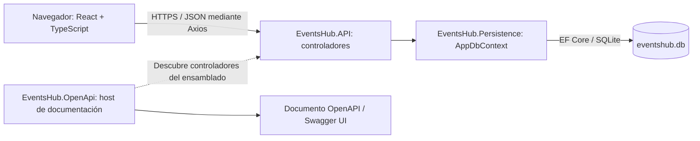
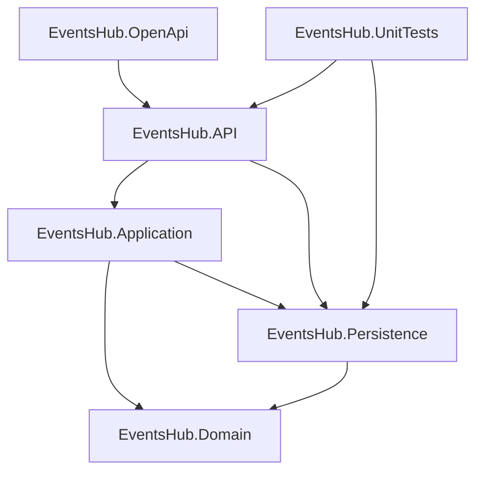
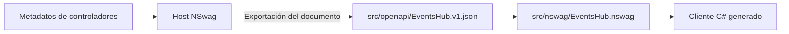
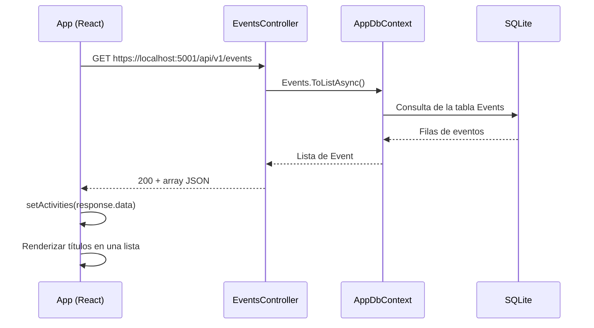

# Arquitectura de EventsHub

Documento basado en el código del repositorio revisado el 20 de septiembre de 2026. Describe el estado implementado y distingue las limitaciones actuales de las posibles mejoras.

## 1. Vista general

EventsHub permite consultar eventos almacenados en SQLite. La interfaz muestra sus títulos y la API ofrece consultas del listado y del detalle. También conserva un endpoint de ejemplo de pronóstico del tiempo.

El repositorio reúne un frontend React y un backend ASP.NET Core organizado en proyectos. La ejecución funcional sigue una arquitectura cliente-servidor con un backend monolítico y separación parcial por capas: los controladores consultan directamente `AppDbContext`. El proyecto `Application` existe, pero todavía no contiene casos de uso ni interviene en las peticiones. No se implementan CQRS, mediadores ni repositorios propios.



El host OpenAPI es una herramienta auxiliar que se ejecuta por separado. El frontend consume la API principal y no utiliza el cliente C# generado por NSwag.

## 2. Mapa del repositorio y tecnologías

Las rutas de esta tabla parten de la raíz del repositorio.

| Componente | Ubicación | Tecnología y responsabilidad |
| --- | --- | --- |
| API | `src/EventsHub.API` | C#, .NET 10, ASP.NET Core; HTTP, CORS, inyección de dependencias y arranque de la base de datos |
| Application | `src/EventsHub.Application` | Biblioteca .NET 10; estructura reservada para lógica de aplicación, actualmente sin implementación |
| Domain | `src/EventsHub.Domain` | Biblioteca .NET 10; entidad `Event`, sin dependencias de otros proyectos |
| Persistence | `src/EventsHub.Persistence` | EF Core SQLite 10.0.11; contexto, migraciones y datos iniciales |
| OpenAPI | `src/EventsHub.OpenApi` | ASP.NET Core, NSwag 14.7.1 y Newtonsoft.Json; generación y presentación del contrato |
| Web | `web` | React 19, TypeScript 6, Vite 8, Material UI 9, Emotion y Axios |
| Pruebas de controladores | `tests/EventsHub.UnitTests` | NUnit 4, adaptador NUnit, Microsoft.NET.Test.Sdk y Coverlet; usan SQLite real |
| Pruebas HTTP | `tests/EventsHub.IntegrationTest` | Colección Bruno en YAML con entorno local |
| Artefactos OpenAPI | `src/openapi`, `src/nswag`, `src/src/EventsHub.OpenApi/Generated` | Contrato JSON, configuración y cliente C# generado |

La solución [EventsHub.slnx](../EventsHub.slnx) contiene los cinco proyectos del backend y el proyecto NUnit. El frontend y la colección Bruno se ejecutan por separado.

### Dependencias entre proyectos .NET

Cada flecha representa un `ProjectReference` directo, no una llamada en tiempo de ejecución.



La referencia de `Application` a `Persistence` y el acceso directo de los controladores al contexto son relevantes al extender el sistema: la estructura actual no establece una frontera que independice los casos de uso del almacenamiento.

## 3. Fichas de componentes

### EventsHub.API

[Program.cs](../src/EventsHub.API/Program.cs) registra controladores, `AppDbContext` con SQLite y CORS. Antes de atender peticiones aplica migraciones y ejecuta el inicializador de datos. Finalmente publica los controladores con `MapControllers()`.

[EventsHubBaseController](../src/EventsHub.API/Controllers/EventsHubBaseController.cs) aporta `[ApiController]` y la ruta `api/v1/[controller]`. [EventsController](../src/EventsHub.API/Controllers/EventsController.cs) recibe el contexto por constructor y ejecuta consultas asíncronas. Devuelve entidades del dominio directamente; no hay DTOs ni una capa de transformación del contrato HTTP.

Se inicia con `dotnet run --project src/EventsHub.API --launch-profile https` desde la raíz. Sus consultas se verifican mediante NUnit y Bruno, como se detalla en la sección de pruebas.

### EventsHub.Application

El [proyecto](../src/EventsHub.Application/EventsHub.Application.csproj) referencia `Domain` y `Persistence`, pero no contiene clases de aplicación. No tiene un proceso ejecutable, servicios registrados ni pruebas propias. Se compila junto con la solución.

### EventsHub.Domain

Contiene [Event.cs](../src/EventsHub.Domain/Event.cs), el modelo compartido por persistencia y API. Es una clase con propiedades; no incorpora métodos de negocio, validadores ni relaciones con otras entidades. No tiene dependencias NuGet explícitas ni ejecución independiente. Las pruebas de consulta ejercitan este modelo indirectamente.

### EventsHub.Persistence

[AppDbContext](../src/EventsHub.Persistence/AppDbContext.cs) expone `DbSet<Event> Events`. La [migración inicial](../src/EventsHub.Persistence/Migrations/20260917130757_InitialCreate.cs) crea la tabla `Events`; el snapshot conserva el modelo para migraciones posteriores.

[DbInitializer](../src/EventsHub.Persistence/DbInitializer.cs) inserta diez eventos cuando la tabla está vacía: cinco pasados y cinco futuros, calculados respecto a `DateTime.Now`. Si ya existe cualquier evento, no agrega datos. Los identificadores se generan al crear las entidades, por lo que varían entre bases inicializadas por separado.

Es una biblioteca utilizada por la API y las pruebas. No necesita un servidor de base de datos independiente: SQLite persiste en un archivo local.

### EventsHub.OpenApi y artefactos generados

El [host](../src/EventsHub.OpenApi/Program.cs) descubre los controladores del ensamblado de la API mediante `AddApplicationPart`, registra NSwag y configura Newtonsoft.Json con nombres JSON en camelCase. Expone el documento denominado `EventsHub` y Swagger UI. Declara Moq como dependencia, pero el arranque actual no lo utiliza.

Sus perfiles definen HTTPS en `5011` y HTTP en `5010`. Se inicia desde la raíz con `dotnet run --project src/EventsHub.OpenApi`. **Existe una limitación de configuración:** registra los controladores como servicios, incluido `EventsController`, pero no registra su dependencia `AppDbContext`. Esto puede impedir el arranque cuando se valida la inyección de dependencias o la activación del controlador. Su operatividad debe comprobarse antes de regenerar el contrato; no sustituye al host de la API.

El flujo previsto de generación es:



El [manifiesto local](../.config/dotnet-tools.json) fija `nswag.consolecore` 14.7.1. La [configuración NSwag](../src/nswag/EventsHub.nswag) toma el JSON existente como entrada; no consulta automáticamente al host. Desde la raíz, `dotnet tool restore` restaura la herramienta y `dotnet tool run nswag run src/nswag/EventsHub.nswag` genera el cliente a partir de ese JSON.

La salida configurada es relativa al directorio `src/nswag`, por lo que termina en [src/src/EventsHub.OpenApi/Generated/EventsHubRpcClient.generated.cs](../src/src/EventsHub.OpenApi/Generated/EventsHubRpcClient.generated.cs). Ese archivo está fuera del proyecto real `src/EventsHub.OpenApi` y no aparece incluido explícitamente en sus archivos de proyecto. No se debe asumir que se compila o que tiene consumidores. Los artefactos generados deben actualizarse mediante su proceso de generación.

### Frontend web

[main.tsx](../web/src/main.tsx) monta React con `StrictMode`, estilos globales y tipografías Roboto. [App.tsx](../web/src/App.tsx) mantiene el listado en `useState`, consulta la API con Axios en `useEffect` y renderiza títulos con componentes Material UI.

El tipo global [Activity](../web/src/lib/types/index.d.ts) describe manualmente la respuesta. No se genera desde OpenAPI. No hay router, almacenamiento global ni pantallas de edición o detalle. Tampoco se muestran estados explícitos de carga o error; la promesa de Axios no tiene un manejador de rechazo.

[vite.config.ts](../web/vite.config.ts) establece el puerto `3000` e incorpora React, React Compiler mediante Babel y `vite-plugin-mkcert` para HTTPS local. La URL de la API está escrita directamente en `App.tsx`. El proyecto tiene scripts de desarrollo, compilación, lint y preview, pero no un script de pruebas automatizadas.

### Componentes de pruebas

[EventsHub.UnitTests](../tests/EventsHub.UnitTests/EventsHub.UnitTests.csproj) instancia controladores directamente con un contexto compartido. [GlobalTestSetup](../tests/EventsHub.UnitTests/GlobalTestSetup.cs) migra y siembra una base SQLite y libera el contexto al terminar. Aunque el proyecto se llama `UnitTests`, las pruebas integran acceso real a persistencia y no verifican el transporte HTTP.

La [colección Bruno](../tests/EventsHub.IntegrationTest/opencollection.yml) sí envía peticiones HTTP a la API activa. Su entorno `local` define `https://localhost:5001/api/v1` como `baseUrl`. No forma parte de la ejecución de `dotnet test`.

## 4. Flujo de consulta de eventos



La consulta carga todos los eventos, sin paginación, filtros ni orden explícito. Para el detalle, el controlador usa `FindAsync(id)` y devuelve `404` con el mensaje `The event was not found.` si no existe. El frontend actual solo consume el listado.

## 5. Modelo de datos y contrato HTTP

### Entidad Event

| Propiedad C# | Tipo C# | Columna SQLite | Observaciones |
| --- | --- | --- | --- |
| `Id` | `string` | `TEXT`, clave primaria | GUID convertido a texto por defecto |
| `Title` | `string` | `TEXT` | Propiedad `required` |
| `Date` | `DateTime` | `TEXT` | Fecha del evento |
| `Description` | `string` | `TEXT` | Propiedad `required` |
| `Category` | `string` | `TEXT` | Texto libre; no hay catálogo ni enum |
| `IsCancelled` | `bool` | `INTEGER` | `false` por defecto |
| `City`, `Venue` | `string` | `TEXT` | Propiedades `required` |
| `Latitude`, `Longitude` | `string` | `TEXT` | Propiedades `required`; coordenadas almacenadas como texto |

La migración define todas las columnas como no anulables. `required` expresa una obligación de inicialización en C#; el modelo no contiene validaciones de negocio explícitas. La API serializa nombres en camelCase, por ejemplo `isCancelled`.

### Endpoints implementados

| Método | Ruta utilizada por los clientes | Resultado |
| --- | --- | --- |
| GET | `/api/v1/events` | `200`, array de eventos |
| GET | `/api/v1/events/{id}` | `200`, evento; `404` si no existe |
| GET | `/api/v1/weatherforecast` | `200`, cinco pronósticos generados con valores aleatorios |

Las rutas se construyen con el nombre del controlador; el documento OpenAPI las representa como `Events` y `WeatherForecast`. Los clientes del repositorio usan minúsculas. No hay endpoints POST, PUT, PATCH o DELETE ni autenticación o autorización configuradas.

## 6. Configuración y comportamiento transversal

| Aspecto | Implementación actual |
| --- | --- |
| Conexión | `ConnectionStrings:SqliteConnection` en los archivos de configuración de la API: `Data source = eventshub.db` |
| Ubicación de SQLite | Ruta relativa al directorio de trabajo del proceso; no es una ruta absoluta compartida por todos los componentes |
| Arranque | Aplica migraciones y datos iniciales antes de `Run()`, sin limitarlo al entorno de desarrollo |
| Error de inicialización | Registra la excepción con `LogError` y continúa hacia el arranque HTTP; el proceso puede iniciar sin una base preparada |
| CORS | Permite cualquier cabecera y método desde `http://localhost:3000` y `https://localhost:3000` |
| API local | Perfil `https`: `https://localhost:5001` |
| Web local | Puerto solicitado `3000`, HTTPS mediante mkcert |
| OpenAPI local | Perfil `EventsHub.OpenApi`: `https://localhost:5011` y `http://localhost:5010` |
| Errores HTTP | `NotFound` explícito para detalle inexistente; no hay middleware propio para unificar errores |
| Convenciones | Métodos asíncronos con sufijo `Async`, nombres PascalCase en C#, componentes React en PascalCase |

Los puertos del frontend, su URL de Axios, el entorno Bruno y CORS deben mantenerse alineados. Si Vite selecciona otro puerto por estar ocupado `3000`, ese origen no estará permitido por la configuración actual. Los certificados locales deben ser aceptados por el navegador para que las peticiones HTTPS funcionen.

## 7. Ejecución y verificación local

Se requiere SDK .NET 10 y una instalación de Node.js/npm compatible con las dependencias de `web/package-lock.json`. Los comandos siguientes corresponden a la solución, los perfiles y los scripts existentes. Esta revisión documental los contrastó con esos archivos; no implica que se hayan ejecutado compilaciones, servidores o pruebas.

Desde la raíz del repositorio:

```powershell
dotnet restore
dotnet build EventsHub.slnx
dotnet run --project src/EventsHub.API --launch-profile https
```

En otra terminal, desde `web/`:

```powershell
npm ci
npm run dev
```

Para verificar el backend, desde la raíz:

```powershell
dotnet test EventsHub.slnx
dotnet test EventsHub.slnx --collect:"XPlat Code Coverage"
```

El segundo comando es una alternativa para recolectar cobertura; no hay un umbral numérico configurado. Las tres pruebas de controladores comprueban el conteo del listado, un detalle existente y el resultado `404`. Usan `Data source=eventshub.db`, conservan el archivo y no deben apuntar a datos valiosos.

Para verificar el frontend, desde `web/`:

```powershell
npm run build
npm run lint
```

`build` ejecuta `tsc -b` y `vite build`; `lint` ejecuta ESLint. `npm run preview` sirve la compilación, pero no tiene un puerto alineado explícitamente con CORS: antes de probar llamadas a la API desde preview, hay que revisar el origen efectivo. La comprobación manual consiste en abrir la URL que indique Vite, confirmar que aparecen títulos y revisar que la consulta a `/api/v1/events` devuelve `200`.

Para las pruebas HTTP, abrir la colección Bruno, seleccionar `local` y mantener la API activa. La prueba de detalle `200` contiene un identificador fijo: debe sustituirse por uno del listado de la base utilizada. La colección comprueba listado, detalle existente, detalle inexistente y cinco resultados de pronóstico.

## 8. Limitaciones y puntos de evolución

Estas observaciones describen diferencias verificables en los archivos; no representan cambios ya realizados en la aplicación.

| Hallazgo | Implicación y posible evolución |
| --- | --- |
| `Application` sin implementación y controladores ligados a EF Core | Si crece la lógica, definir casos de uso y sus fronteras antes de añadir comportamiento a los controladores |
| La API expone `Event` directamente | Los cambios del modelo pueden afectar al contrato; considerar DTOs cuando se necesite evolucionar ambas partes por separado |
| `Activity.latitude` y `longitude` son `number`, mientras el backend usa `string` | El tipo TypeScript no coincide con el JSON real; alinear el contrato antes de usar coordenadas en cálculos |
| URL de API fija y ausencia de estados de error/carga | La interfaz requiere cambios de código para apuntar a otro entorno y no explica fallos de red al usuario |
| Listado sin paginación ni orden | Devuelve la tabla completa y no garantiza un orden funcional |
| Host OpenAPI sin registro de `AppDbContext` | Debe resolverse su dependencia para poder activar `EventsController`; ver ficha del host |
| Cliente generado dentro de `src/src` | La ruta de salida está fuera del proyecto previsto; revisar la configuración antes de integrarlo |
| OpenAPI guardado solo declara `200` para el detalle | El contrato publicado no refleja el `404` implementado |
| Pruebas NUnit con SQLite persistente y contexto compartido | No son pruebas unitarias aisladas; su estado depende de la base disponible |
| Referencia de OpenAPI escrita como `EventsHub.Api` frente al directorio `EventsHub.API` | La diferencia de mayúsculas puede afectar la compilación en sistemas con rutas sensibles a mayúsculas |

La guía [OpenApiSetup.md](OpenApiSetup.md) conserva instrucciones históricas: afirma que faltan proyectos y el manifiesto de herramientas que ahora existen, usa rutas diferentes y describe controladores sin dependencias. Para conocer el estado actual, deben prevalecer los archivos enlazados en este documento. Las notas [DbContextFundamentals.md](DbContextFundamentals.md) y [SoftwareTestingFundamentals.md](SoftwareTestingFundamentals.md) sirven como material complementario de persistencia y pruebas.
